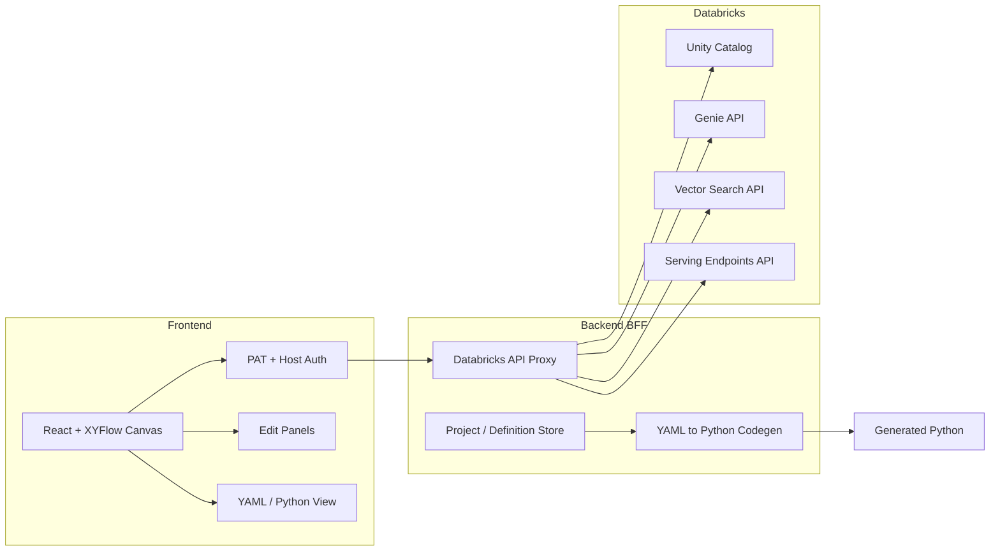

# Databricks Agent Builder: Drag-Drop-Deploy Web App

## Vision

**Principle: Drag, Drop, Deploy.** Users design agent pipelines visually: add Agent and asset blocks (Genie room, Vector Search), wire them as tools with edges, edit settings in panels, then generate Python from a YAML spec and deploy to Databricks model serving.

---

## Architecture Overview




- **Frontend**: React + TypeScript, [@xyflow/react](https://reactflow.dev) (XYFlow) for the node canvas, minimal UI library (e.g. Radix or Tailwind-only).
- **Backend**: Thin BFF (Node + Express or Python FastAPI) that holds PAT and host, proxies all Databricks REST calls, and optionally persists project/definition (file or DB). No PAT in browser in production.
- **Databricks**: REST only (no CLI in browser). PAT + workspace host for auth on every request.

---

## Core Data Model

- **Project**: Contains one or more “flows” (canvases). Has workspace host + PAT reference (server-side only).
- **Flow**: One canvas = one deployable unit (one agent + its tools).
- **Node types** (blocks):
  - **Agent**: foundation model (LLM), optional catalog tables for context, and a list of tool references (edge targets).
  - **Genie room**: Genie space (title, warehouse_id, catalog/schema/tables or serialized_space). Exposed as one “tool” to the agent.
  - **Vector Search**: Vector search index (catalog.schema.index). Exposed as one “tool” to the agent.
- **Edges**: Agent → Genie, Agent → Vector Search (and later MCP / custom tools). Semantics: “this asset is a tool for this agent.”
- **YAML definition**: Single source of truth per flow: nodes (type, id, config) + edges (source, target) + agent-specific (model, tables, tool_ids). Generated from canvas and editable in-app; Python is generated from this YAML.

---

## User Flows (Aligned to Your Story)

1. **Start project**: Create project → name, (optional) workspace + PAT stored server-side.
2. **Create agent**: Add “Agent” block to canvas; it shows as a block. Double-click (or panel) → **Edit settings**: foundation model (dropdown from Databricks foundation model catalog / serving endpoints), select tables from Unity Catalog (catalog/schema/table picker via Unity Catalog APIs).
3. **Create Genie room**: Add “Genie room” block → configure (warehouse, tables, optional sample questions) → create via [Genie Create Space API](https://docs.databricks.com/api/workspace/genie/createspace) (`POST /api/2.0/genie/spaces`). Block shows on canvas with space_id/title.
4. **Add Vector Search**: Add “Vector Search” block → select or create index (Databricks Vector Search Indexes API). Block shows on canvas.
5. **Link as tools**: Draw edges from **Agent** to **Genie** and **Agent** to **Vector Search**. Meaning: “Genie” and “Vector Search” are tools attached to this agent. Only agent → asset edges are tool links; other edges can be disallowed or reserved for future use.
6. **Generate code**: From current canvas state, build **YAML definition** (nodes + edges + config). Show YAML in a side panel or tab; allow edit. **Generate Python**: from YAML, run codegen to produce LangGraph/LangChain agent Python (template with MCP tools + non-MCP tools: Genie as tool, Vector Search as tool).
7. **Deploy to model serving**: Use Databricks Serving Endpoints API to create/update an endpoint that serves the generated agent (e.g. agent wrapped as MLflow model or custom server logic). Deploy step can upload generated code to workspace (e.g. Workspace API or Repos) and trigger job or endpoint creation.

---

## Tech Stack (Modern, Clean, Modular)


| Layer            | Choice                             | Rationale                                                                              |
| ---------------- | ---------------------------------- | -------------------------------------------------------------------------------------- |
| Frontend         | React 18+ / TypeScript, Vite       | Fast, standard, good DX.                                                               |
| Canvas           | @xyflow/react (React Flow)         | “XYFlow” = React Flow; industry standard for node UIs, drag-drop, edges, custom nodes. |
| Styling          | Tailwind CSS                       | Utility-first, no heavy UI framework; keeps design clean and controllable.             |
| UI primitives    | Radix UI (optional)                | Accessible dropdowns, dialogs, tabs for panels; minimal.                               |
| Backend          | Node (Express) or Python (FastAPI) | Thin BFF: auth, proxy, codegen, optional project store.                                |
| State (frontend) | React state + XYFlow state         | Single flow in memory; sync to YAML on “Generate”. No Redux unless needed later.       |
| Persistence      | File-based (JSON/YAML) or SQLite   | Project + flow definitions; PAT never stored in frontend.                              |


---

## Module Breakdown (No Bloat)

- **Frontend**
  - **Canvas**: XYFlow wrapper; custom node components (AgentNode, GenieNode, VectorSearchNode); edge type “tool_link”; handlers for add node, delete, edge connect (only allow agent → asset).
  - **Panels**: “Add block” toolbar; double-click or selection opens **Edit panel** (right or modal): Agent (model picker, table picker), Genie (warehouse, tables, create/fetch), Vector Search (index picker/create). Use Databricks API responses for dropdowns.
  - **Auth**: Screen or sidebar: workspace host URL + PAT; send to BFF which validates (e.g. `GET /api/2.0/current-user` or list workspaces) and stores in session (or encrypted env). All subsequent API calls go via BFF.
  - **YAML / Python**: Two tabs or panels: (1) YAML editor (generated from flow, editable), (2) “Generate Python” button and read-only Python output (from codegen). Copy/download.
  - **Deploy**: Button “Deploy to model serving” → BFF creates/updates serving endpoint (and optionally uploads code to workspace). Show endpoint URL and status.
- **Backend**
  - **Auth middleware**: Read PAT + host from body/headers/session; attach to outgoing Databricks requests.
  - **Proxy routes**: `/api/databricks/*` → forward to `https://{host}/api/2.0/...` or `2.1/...` with PAT in header. One route per area (catalogs, tables, genie, vector-search, serving-endpoints, foundation models, etc.) to keep it simple.
  - **Codegen**: Input = YAML definition (nodes + edges + config). Output = single Python file: LangGraph/LangChain agent, with tools = [Genie tool, Vector Search tool, …]. Use a small template engine (e.g. EJS or Jinja2) and a single template file; no heavy codegen framework.
  - **Project/flow store**: Optional. Save/load flow by id; return YAML or graph JSON.
- **Generated Python template**
  - Structure: load config from env or YAML path; create LLM client (Databricks foundation model); build list of tools (Genie API wrapper, Vector Search query wrapper, plus MCP if present); LangGraph graph with tool-calling node; expose `invoke()` or FastAPI `POST /invoke` for serving. MCP tools integrated via `langchain-mcp-adapters` or equivalent; non-MCP tools = plain Python functions calling Genie/Vector Search APIs.

---

## Databricks APIs to Use

- **Auth**: PAT in `Authorization: Bearer <token>`, host = `https://<workspace-host>`.
- **Unity Catalog**: [Catalogs](https://docs.databricks.com/api/workspace/catalogs), [Schemas](https://docs.databricks.com/api/workspace/schemas), [Tables](https://docs.databricks.com/api/workspace/tables) for table picker.
- **Genie**: [Create Space](https://docs.databricks.com/api/workspace/genie/createspace), List/Get/Update Space; Conversation API for the actual “Genie as tool” calls in the agent.
- **Vector Search**: Vector Search Endpoints + [Indexes](https://docs.databricks.com/api/workspace/vectorsearchindexes) (create, list, query).
- **Foundation models**: Use existing foundation model endpoints or Model Serving list to populate “LLM” dropdown; agent code uses same endpoint for chat.
- **Serving Endpoints**: [Create](https://docs.databricks.com/api/workspace/servingendpoints/create) / Update / Get for deploying the agent as a custom or MLflow-backed endpoint.

---

## YAML Definition Shape (Example)

```yaml
version: "1"
flow:
  nodes:
    - id: agent_1
      type: agent
      config:
        name: "Main Agent"
        model: "databricks-meta-llama-3-1-405b-instruct"  # or endpoint name
        catalog_tables: ["catalog.schema.table1", "catalog.schema.table2"]
    - id: genie_1
      type: genie
      config:
        space_id: "e1ef3471-..."
        title: "Sales Genie"
        warehouse_id: "..."
    - id: vs_1
      type: vector_search
      config:
        index_name: "catalog.schema.my_index"
  edges:
    - source: agent_1
      target: genie_1
      type: tool
    - source: agent_1
      target: vs_1
      type: tool
```

Codegen reads this and emits one Python file: agent with LLM + Genie tool + Vector Search tool (+ optional MCP tools section).

---

## File Structure (Suggested)

```
agent-builder/
├── frontend/
│   ├── src/
│   │   ├── components/
│   │   │   ├── canvas/           # XYFlow, custom nodes, edges
│   │   │   ├── panels/           # Agent, Genie, VectorSearch editors
│   │   │   ├── auth/
│   │   │   └── code/             # YAML + Python view
│   │   ├── api/                  # BFF client (auth, proxy, codegen, deploy)
│   │   ├── store/                # flow state, selected node
│   │   └── types/                # Node types, YAML types
│   └── package.json
├── backend/
│   ├── routes/
│   │   ├── auth.js
│   │   ├── databricks.js         # proxy to Databricks
│   │   ├── codegen.js            # YAML → Python
│   │   └── deploy.js
│   ├── lib/
│   │   ├── databricks-client.js
│   │   └── codegen/
│   │       └── agent-template.py.j2  # or .ejs
│   └── package.json or requirements.txt
└── README.md
```

---

## Implementation Order

1. **Scaffold**: Frontend (Vite + React + TS + XYFlow + Tailwind) and Backend (Express or FastAPI) with PAT + host auth and one proxy route to Databricks (e.g. current-user or catalogs).
2. **Canvas**: Custom nodes (Agent, Genie, Vector Search), “tool” edges from agent to assets only, add/delete, layout.
3. **Agent panel**: Double-click agent → edit model (dropdown from API) and catalog tables (catalog/schema/table picker via Unity Catalog APIs).
4. **Genie panel**: Create/list Genie spaces via API; create space from form; show space_id in node; wire as tool in codegen.
5. **Vector Search panel**: List/create indexes via API; select index; wire as tool in codegen.
6. **YAML**: Serialize flow → YAML; YAML editor; re-hydrate canvas from YAML (optional).
7. **Codegen**: YAML → Python (single template: LangGraph agent + Genie tool + Vector Search tool); show in UI, copy/download.
8. **Deploy**: Call Serving Endpoints API (and optionally Workspace API to upload code); show endpoint URL and status.
9. **Later**: MCP tools in UI (e.g. list of MCP server URLs/commands, add as nodes and edges); “Create Databricks App” from agent endpoint.

---

## Out of Scope for First Version

- **Databricks App from agent endpoint**: Noted as “later”; plan only references it as a future addition (e.g. “Create App” button that uses [Apps API](https://docs.databricks.com/api/workspace/apps) and points to the deployed agent endpoint).
- **CLI**: You mentioned “CLI and APIs”; the app uses REST only. CLI could be a separate small wrapper (e.g. `agent-builder deploy --yaml flow.yaml`) that calls the same BFF or Databricks directly.
- **Multi-flow versioning**: Single flow per project in v1; multi-flow and versioning can be added when you need it.

---

## Risks and Mitigations

- **PAT in browser**: Never send PAT to the frontend in production; all Databricks calls go through the BFF with server-stored PAT/session.
- **CORS**: BFF and frontend on same origin or correct CORS; Databricks calls only from backend.
- **Agent deployment format**: Databricks serving typically expects MLflow model or custom container. Plan: generate a small wrapper (e.g. FastAPI app that loads the agent and exposes `/invoke`) and deploy as “custom model” or document one-time setup (e.g. Repo + Job that runs the agent as HTTP server) so “Deploy” has a clear path.

---

## Summary

- **Frontend**: React + TypeScript + Vite + **@xyflow/react** (XYFlow) + Tailwind; custom nodes for Agent, Genie, Vector Search; tool edges; edit panels; YAML + Python view; deploy button.
- **Backend**: Thin BFF with PAT + host; proxy all Databricks APIs; codegen (YAML → Python from one template); optional project/flow store; deploy via Serving Endpoints (and optionally Workspace/Repos).
- **Generated code**: One Python file per flow: LangGraph/LangChain agent, foundation model, Genie + Vector Search (+ MCP) as tools, suitable for model serving or Repo job.
- **Design**: Clean, modular, minimal dependencies; no code bloat; single source of truth = YAML; Python = generated artifact.

This gives you a concrete, step-by-step plan to implement the Drag-Drop-Deploy Databricks agent builder and a path to add “Databricks App from agent endpoint” later.